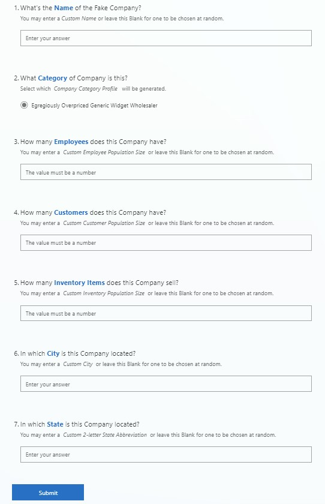
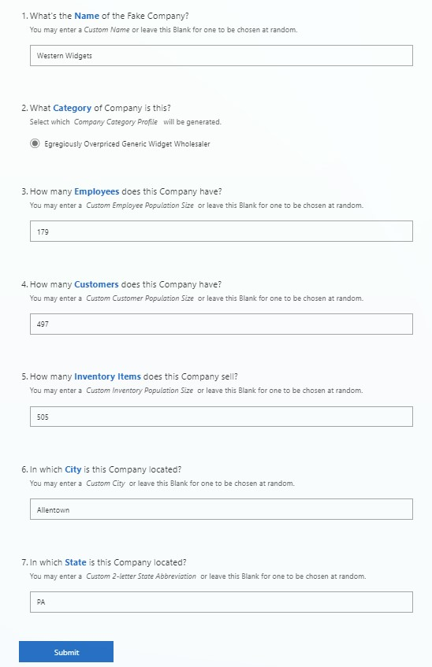

# Make_Fake  

$\\\,$   
#### Overview
Generates *Excel Spreadsheets* consisting of $\quad\text{randomized fake data} \quad$ modeled to simululate a Company's `Employee`, `Customer`,`Inventory`, and `Transaction` Reports.  
$\\\,$   
#### Usage     
##### Invocation Metods
###### Microsoft Form $\longrightarrow$ Power Automate Flow
> May be invoked without parameters, providing randomly selected default attributes...
> $\\\,$   
> 
> $\\\,$   
> $\\\,$   
> ...or may be alternatively invoked using custom parameters to define the attributes.
> $\\\,$   
> 

$\\\,$      
###### PowerShell
```powershell
Import-Module New-FakeCompany.psm1

# May be invoked without parameters, providing randomly selected default attributes...
New-FakeCompany

# ...or may be alternatively invoked using custom parameters to define the attributes.
New-FakeCompany `
    -$Name='Western Widgets' `
    -$Category='Egregiously Overpriced Generic Widget Wholesaler' `
    -$EmployeeSize=179 `
    -$CustomerSize=497 `
    -$InventorySize=505 `
    -$City='Allentown' `
    -$State='PA'
``` 

$\\\,$   

###### Python 
   
```python
from Make_FakeCompany.py import FakeCompany()

# May be invoked without parameters, providing randomly selected default attributes...
fake_company_with_random_attributes = FakeCompany()

# ...or may be alternatively invoked using custom parameters to define the attributes.
fake_company_i_made_up = FakeCompany(
    name='Western Widgets',
    category='Egregiously Overpriced Generic Widget Wholesaler'
    employee_size=179
    customer_size=497
    inventory_size=505
    city='Allentown'
    state='PA'
)
```
$\\\,$
##### Deliverables
###### A **Text File** detailing the randomnly generated Company's given $Attributes$:
> ```
> Name: Western Widgets
> Category: Egregiously Overpriced Generic Widget Wholesaler
> Domain: Western-Widgets.com
> # of Employees: 179
> # of Customers: 497
> # of Inventory Items: 505
> City:  Allentown
> State: PA
> Zip Code: 18432
> Departments: [
>    'Management', 
>    'Accounting', 
>    'Sales', 
>    'Marketing', 
>    'Security', 
>    'Operations', 
>    'IT', 
> ]
> Employee Attributes: [
>    'Employee ID', 
>    'First Name', 
>    'Last Name', 
>    'Email', 
>    'Username', 
>    'Password', 
>    'Date Of Birth', 
>    'SSN', 
>    'Phone Number', 
>    'Address', 
>    'City', 
>    'State', 
>    'Zip Code', 
>    'Hire Date', 
>    'Salary', 
>    'Department', 
> ]
> Customer Attributes: [
>    'Customer ID', 
>    'First Name', 
>    'Last Name', 
>    'Email', 
>    'Username', 
>    'Password', 
>    'Phone Number', 
>    'Address', 
>    'City', 
>    'State', 
>    'Zip Code', 
>    'Card Provider', 
>    'Card Number', 
>    'CVV', 
>    'Expiration Date', 
> ]
> Inventory Attributes: [
>    'Product ID', 
>     'Product', 
>     'Year', 
>     'Price', 
>     'Product Quantity', 
> ]
>```

$\\\,$
###### **4 Excel Speadsheets** detailing the Company's `Employees`,`Customers`,`Inventory`, and `Transaction` $Records$
> 1. [Employee Records](powershell/to_excel/Western%20Widgets%20-%20Egregiously%20Overpriced%20Generic%20Widget%20Wholesaler%C2%A0%20-%20Employees.xlsx)
> 2. [Customer Records](powershell/to_excel/Western%20Widgets%20-%20Egregiously%20Overpriced%20Generic%20Widget%20Wholesaler%C2%A0%20-%20Customers.xlsx)
> 3. [Inventory Records](powershell/to_excel/Western%20Widgets%20-%20Egregiously%20Overpriced%20Generic%20Widget%20Wholesaler%C2%A0%20-%20Inventory.xlsx)
> 4. [Transaction Records](powershell/to_excel/Western%20Widgets%20-%20Egregiously%20Overpriced%20Generic%20Widget%20Wholesaler%C2%A0%20-%20Transactions.xlsx)
